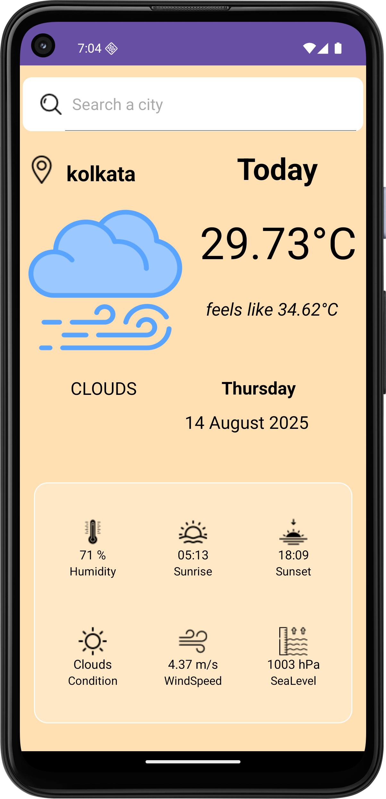

# Weather App 🌤️

A comprehensive **Weather App** that provides detailed information about current and upcoming weather conditions for any city worldwide. This app is designed to give users a complete overview of the weather in an intuitive and visually appealing interface.

---

## Features

- **Current Weather Details:**  
  Displays temperature, humidity, wind speed, pressure, and more.  

- **Forecast Information:**  
  Get hourly and daily weather forecasts for upcoming days.  

- **Location-Based Search:**  
  Search weather by city name. Provides a default city if none is entered.  

- **Dynamic UI with Stickers:**  
  Fun and interactive stickers to represent different weather conditions.  

- **Weather Conditions & Alerts:**  
  Get real-time weather updates including sunny, rainy, cloudy, stormy, and other conditions.  

- **Additional Info:**  
  Sunrise & sunset times, feels-like temperature, visibility, and UV index.

---

## Screenshots

### Home Screen

### Search & Forecast

---

## Tech Stack

- **Language:** Kotlin  
- **Platform:** Android  
- **API:** OpenWeatherMap (or your weather API)  
- **Libraries:** Retrofit, Gson

---

## Usage

1. Open the app.  
2. Enter the city name or use the default city.  
3. Explore the detailed weather information and forecast.  

---

## Future Enhancements

- Add **weather widgets** for home screen.  
- Implement **push notifications** for weather alerts.  
- Include **interactive maps** showing weather patterns.  

---

## License

This project is licensed under the MIT License - see the [LICENSE](LICENSE) file for details.
